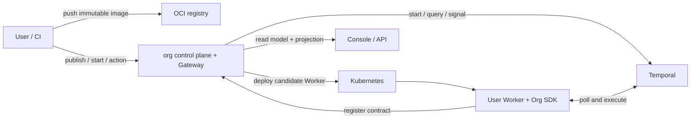

# 架构概览

本页面向已经跑通过 Hello、希望理解系统边界的读者。第一次使用请先读 [核心概念](../concepts.md) 和 [本地快速上手](../getting-started.md)。

## 一句话边界

Worker 决定业务 Workflow 如何执行；org control plane 决定哪个版本可以运行、谁可以触发和操作、用户能看到什么；Temporal 和 Kubernetes 是底层执行基础设施。

## 组件关系



## 谁负责什么

| 组件 | 负责 | 不负责 |
|---|---|---|
| 用户 Worker repository | Definition、Activities、业务 input/output、image build/push | Tenant 选择、平台 routing、平台 credential |
| Org SDK | Workflow adapter、stable node identity、contract registration、semantic projection | control-plane authorization、Kubernetes deployment |
| org control plane | Tenant authorization、Worker/Version/Run、quota、deployment、promotion、read model、Audit | 构建 image、执行业务 DAG |
| Gateway | Run/action authorization、schema validation、idempotency、delivery state | 让浏览器直连 Temporal |
| Temporal | durable execution、history、retry、timer、Signal、Worker versioning | 推断业务 DAG、执行 Tenant authorization |
| Kubernetes | 运行候选和 Ready Worker workload | 提供 org 产品模型或业务状态 |

## 发布路径

用户发布的是不可变 image digest，不是源码或 manifest 文件：

```text
CI push image
  → org 接收 digest-only publish request
  → Kubernetes 启动 candidate Worker
  → Org SDK 从 typed Definition 生成并注册 contract
  → org 确认 Worker poller 可见
  → pinned contract probe 通过
  → Version Ready / Current
```

contract 由实际运行的 Org SDK 自动注册，并在 Console/API 中只读展示。用户不能上传另一份 contract 覆盖运行时声明。

## Run 路径

```text
用户触发 Workflow
  → control plane 解析 Current 或显式历史 Version
  → Temporal 创建 execution
  → Worker 执行 Workflow 与 Activities
  → Org SDK 更新 semantic projection
  → control plane 验证并保存 read model
  → Console 展示 dynamic DAG
```

每次触发都创建独立 Run。历史 Version 可以继续服务 pinned 长运行 Workflow；显式选择历史 Version 不会改变 Current。

## Dynamic DAG 的可信来源

Workflow 可以根据已记录的 Activity result 执行 if/else、fan-out 或 join，节点不一定在发布时全部确定。

Org SDK 在 deterministic Workflow execution 中维护 semantic projection，报告：

```text
pending / waiting-for-user / running / completed / failed / skipped / cancelled
```

Console 只消费经过 control plane 验证的 projection。它不从 Temporal Event History 猜测业务节点，也不假定固定节点数或坐标。

## 人工 action 路径

`AwaitConfirmation` 或 `WaitForAction` 是 Workflow 内可恢复的等待点，不是阻塞 Activity：

```text
projection = waiting-for-user
  → Console 根据 input schema 展示 action
  → Gateway 验证 Tenant、permission、revision、Idempotency-Key
  → Gateway 发送受控 action
  → Workflow 接受或拒绝
  → projection 更新
```

网络中断可能产生 `delivery-unknown`。客户端必须使用同一 `Idempotency-Key` 查询或安全重试，不能只修改浏览器状态假装 Workflow 已推进。

## Tenant 与共享基础设施

产品隔离边界是 Tenant。当前底层使用：

- 一个共享 platform Temporal Namespace。
- 一个共享 platform Kubernetes Namespace。

Tenant isolation 由 control plane 的认证、授权、命名、store、quota 和 Audit 共同执行。共享基础设施不能被描述成 Kubernetes 或 Temporal 原生提供的硬多租户隔离。

完整术语约束见 [org glossary](glossary.md)。

## 外部副作用

Workflow 代码不能直接访问外部服务，外部 I/O 只能由 Activity 执行。

Temporal 提供可靠 retry，但不承诺外部效果 exactly once。Worker 在外部写成功、向 Temporal 确认前崩溃时，Activity 可能重试。因此 write Activity 必须传播 stable idempotency key，或提供 reconciliation/compensation policy。

## 继续深入

- [发布 WorkerVersion](../api/publish-worker-version.md)：publish request 和状态检查。
- [本地开发与 E2E](../development.md)：维护 control plane 和真实验收。
- [`docs/specs/`](../specs/)：设计、amendment 和实现验收依据；不属于新手阅读路径。
