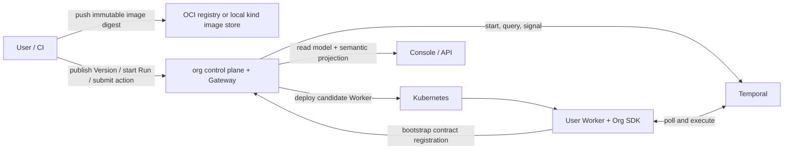

# Architecture Overview

org把“业务流程如何表达”和“版本如何安全运行、触发与观察”分开。用户主要面对Org SDK、Console/API和自己的Worker repository。

> 产品术语遵循 [org glossary](glossary.md)：Tenant是产品隔离边界，不映射为底层资源边界。



## 职责边界

| 组件 | 负责 | 不负责 |
|---|---|---|
| 用户Worker repository | typed Definition、Activities、业务input/output、image build/push | Tenant选择、routing名称、平台credential |
| Org SDK | deterministic Workflow adapter、Activity lifecycle、stable IDs、dynamic semantic projection、bootstrap contract registration | 执行控制面授权、部署Kubernetes资源 |
| org control plane | Tenant授权、Worker/Version/Run、digest发布、配额、部署、promotion、read model与Audit | 构建或push用户image、执行业务DAG |
| Gateway | Run/action授权、schema校验、Idempotency-Key和delivery状态 | 让浏览器直接发送底层Signal |
| Worker | 轮询并执行用户Workflow/Activities | 决定自己属于哪个Tenant/Worker/Version |
| Temporal | 持久执行、timer、retry、Signal与Worker versioning | 推断产品DAG或替org做Tenant授权 |
| Kubernetes | 运行candidate Worker Pod并执行资源/security context | 在共享platform Kubernetes Namespace中按Tenant label提供原生硬配额 |

org当前使用一个shared platform Temporal Namespace和一个shared platform Kubernetes Namespace。Tenant隔离由control plane的认证、授权、命名、store和配额规则执行；共享基础设施不应被描述为硬隔离。

## 动态 DAG 的可信来源

Workflow可以根据已记录的Activity result执行if/else、fan-out或join，因此节点数和依赖不一定在发布时全部确定。Org SDK在deterministic Workflow执行中维护semantic projection，逐节点报告：

```text
pending / waiting-for-user / running / completed / failed / skipped / cancelled
```

Console的dynamic DAG renderer只消费这份validated semantic projection。它不会从Temporal Event History猜测业务节点，也不假定固定节点数或固定坐标。

Workflow代码本身不能调用外部服务。外部I/O只能由Activity执行；Workflow依据Temporal已经记录的Activity result决定后续路径。

## 人工操作

`AwaitConfirmation`或自定义`WaitForAction`是Workflow内可恢复的idle node，不是一个阻塞Activity。典型过程：

```text
projection = waiting-for-user
  → Console按input schema展示action
  → Gateway验证Tenant、permission、revision与Idempotency-Key
  → Gateway发送受控action
  → Org SDK恢复Workflow并更新projection
```

网络中断可能让action处于`delivery-unknown`；客户端应使用同一Idempotency-Key查询或安全重试，不能只修改浏览器状态。

## WorkerVersion promotion

用户发布不可变image digest后，Version先保持pending：

```text
candidate deployed
  → Org SDK auto-registration accepted
  → Worker poller visible
  → pinned contract probe verified
  → Ready / Current
```

contract由运行中的Org SDK从typed Definition生成并自动注册。用户不能在Console上传或覆盖它。历史Version可以继续服务Pinned长运行Workflow；显式选择历史Version时，每次仍创建独立Run。

## 外部副作用

Temporal提供可靠重试，但不承诺外部效果exactly once。write Activity必须传播stable idempotency key，或声明reconciliation/compensation policy。Worker在外部写成功、向Temporal确认前崩溃时，重试不能重复产生外部效果。

详细protocol、失败状态和验收规则见 [`docs/specs/`](../specs/)；本页只描述用户需要理解的系统边界。
